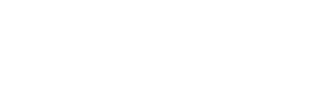

<div align="center">
    
</div>

This script performs advanced trace and log cleaning on your Linux system. Ideal for restoring privacy and erasing evidence of use. (you know what this is for) 

Download and run: 

```bash
curl -L https://github.com/JoaoPedroRMatias/cleanALL-logs/raw/refs/heads/main/cleanALL.sh | sh
```

